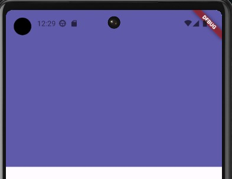
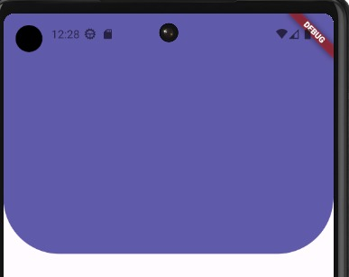
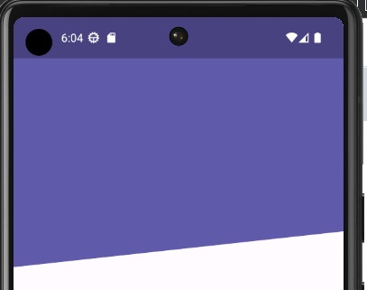

# Flutter Intermedio: Diseños profesionales y animaciones

## _*`Sección 2: Backgrounds - Custom Painter`*_
### _Temas puntuales de la sección_

En esta sección tocaremos los siguientes temas:
- CustomPainter
- Paint
- LineTo
- ¿Cómo coloreamos una figura?
- Diferentes fondos de aplicaciones
- QuadraticBezierTo
- Dimensiones donde podemos pintar
- Canvas
- Y más

Durante la sección hay tareas y ejercicios que les pido que intenten hacer, eso nos ayuda a reforzar lo aprendido.

## _*`14. Header Cuadrado`*_


## _*`15. Header Circular`*_


## _*`16. Problema con los diagonales`*_
Existen limitaciones en el width, ya que flutter solo puede asignar de width lo maximo que hay en pixeles de ancho del movil.

## _*`17. Presentación sobre el customPainter`*_ 
El custompainter necesita 2 metodos, el _paint_ y el _shouldRepaint_

## _*`18. Header Diagonal`*_ 


```dart
class _HeaderDiagonalPainter extends CustomPainter {
  @override
  void paint(Canvas canvas, Size size) {
    final lapiz = Paint();
    
    // Propiedades
    lapiz.color = const Color(0xff615AAB);
    lapiz.style = PaintingStyle.fill; // Para los bordes
    lapiz.strokeWidth = 20;

    // Dibujar con el path
    final path = Path();

    path.moveTo(0, size.height * 0.35);
    path.lineTo(size.width, size.height * 0.30);
    path.lineTo(size.width, 0);
    path.lineTo(0, 0);
    path.lineTo(0, size.height * 0.5);

    canvas.drawPath(path, lapiz);

  }

  @override
  bool shouldRepaint(covariant CustomPainter oldDelegate) {    
    return true;
  }
}
```